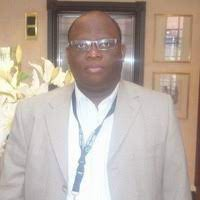

## Dr. Thierry Oscar Edoh

Thierry Oscar Edoh is an associate and affiliated researcher at the University of Bonn (Germany)/Drug Regulatory Affairs and associate professor at ESMT/Dakar-Senegal. He was visiting lecturer at the Institute of Mathematics and Physics (IMSP)/University Abomey-Calavi (Benin-Africa), at IUT Lokossa (Benin-Africa), affiliated at Bundeswehr university Munich/Germany, and affiliated researcher at the Technical University of Munich/department of Applied Software Engineering (Germany). 
He is a guest lecturer at many African, Asian, and East European Universities. High-connected with several European and US-American as well as Brazilian Universities and Researchers.
He received his Diploma in computer sciences from the Technical University of Munich in Germany and hold a Ph.D. at the German Federal Army University (Bundeswehr University of Munich), where he worked for several years on the improvement of rural health care provision and access to healthcare in developing countries using ITC systems. 
He performed postdoctoral research works at the University of Bonn (Germany)/department of pharmacy.  He worked on Drug Regulatory Affairs with a focus on Knowledge discovery and Drug marketing authorization. Member of IEEE.
He was an award-winner at the 1st International Health Informatics Conference IHI ACM in Washington in 2010 and 2013 at the Afrinic conference in Indonesia. 
He has authored 40+ papers in high-impact factor journals like Springer Journal of Medical Systems, etc.
He has supervised 35+ bachelor’s and master’s theses and advised 3 Ph.D. (2 still in progress) and is recently working on Pre-screening for diseases and impact of patient medical education (part of results are published as book chapters in [https://www.igi-global.com/book/pre-screening-systems-early-disease/203701]). He has conduction several research-works on:
- Diseases surveillance and risk prevention using IoT technology 
- Health literacy impact on patient health outcomes 
- Patient-centric data impacts on patient health outcomes 
- Impact of medical education on screening test-outcomes 
- Elderly health care 

Beyond these, he works also on EHR/EMR and genetic data, medical data exchange (tackling data interoperability issues by using blockchain on LH7/FHIR), multimodal EHR/EMR with a focus on speech based EHR.
His main research focus is:
- Health Informatics (Focused Technologies: Artificial Intelligence, Machine, and Deep Learning, Internet of Things, Blockchain, Assistive Robotics, etc.)
- Hospital Information Systems and Speech based Electronical Health and Medical Records
- Medical Data Analytics and Analysis and Medical Data Exchanges, Data Interoperability
- Rural, Palliative, and Elderly Healthcare Informatics
- Knowledge Discovery in Drug Development and Drug Off-Label Use (Pharmacy)
His research interests are mobile computing, pervasive health, and health informatics, telehealth, and IoT in medical applications. 
He is an expert in telemedicine/telehealthcare, health informatics, and bioinformatics. He is also working on the Information system in Drug Regulatory Affairs and Health care systems. 
He has led several telemedicine projects in Africa, Ireland, and Germany.   
He is book author and editor as well as an editorial board member at: 
- Internet Technology Letters (Willey journal) [http://onlinelibrary.wiley.com/journal/10.1002/(ISSN)2476-1508] 
- Empress [http://systems.enpress-publisher.com/index.php/CET/about/editorialTeam]
- Advisory board member and speaker at 
- Internet of Things Community (IOTC) [http://healthcare.iotslam.com/, http://healthcare.iotslam.com/2016-speakers, 
http://iotslam.com/session/sessionpanel-healthcare-iot-a-physicians-view-point/]
He serves as a reviewer for several journals (ex. International Journal of Healthcare Information Systems and Informatics (IJHISI), ACM Computer Review, etc.), and has been selected featured reviewer for May 2018 at ACM Computing Reviews [^1].
He has initiated the annual International Conference on Rural and Elderly Health Informatics Conference and has contributed to organizing several other conferences. He is the co-founder of Africa-Hsoft, a Bio-Medical software vendor with a focus on telemedicine products for developing countries.
Dr. Edoh is the head of IT-Architecture at Consors Finanz, BNP-Paris-bas group, IT senior consultant, and has worked for several years at Siemens AX- Healthcare (Bio-medical department). He was a consultant at BMW in Munich where he led a development team. He was the Technical Lead and Head of Development at Impuls-systems. He worked at the beginning of his career as a software developer, software architect, software tester, where he gained significant experience in software development and has led IT projects.

[^1]: [Todays review.](http://www.computingreviews.com/todaysissue/todaysissue_featured.cfm)

---
## Abstract 

1.	**Patient-centric data in emergency care**
This workshop will discuss the difference between patient-centric and patient-centered data and to what extent they could support personalized emergency care.
Emergency data collection is commonly a manual process. 
Emergency care is a critical medical field. The time, availability and accuracy of contextual information are important parameters that affect the outcome of emergency care delivery. 
In the event of an emergency call, the accuracy of information exchanged is vital to the success of emergency care. The exchange of information or data collected during an emergency transport is also critical to the success of follow-up treatment at the emergency hospital. However, the information provided during emergency care is often inaccurate. During an emergency transport, the processing of data and information collection is essentially manual and time-consuming. Emergency physicians usually do not have access to patients' medical records. As a result, emergency care is still patient-centered rather than patient-centric.
This workshop presents a patient-centric delivery of urgent care services based on information collected through an IoHT system combined with medical provided by an EHR.  The data collected through this system are analyzed and compared to the traditional ones.
ANOVA was used to test the link (correlation) between the rate of the emergency care delivery success and the source of data used

2.	**Technology support for long-term care in home settings**
The nursing shortage is a worldwide healthcare-service-delivery crisis. Modern Information and Communication Technology (ICT) is increasingly being introduced in the Long-Term Care (LTC) to assist older adults to independently aging-in-place. Though the contribution of technologies to mitigate nursing shortage is less investigated. 
This workshop will discuss, in the light of data collected in frame of an empirical study, the potentialities multidimensional smart home automation technology to facilitate aging in place and thus to contribute to mitigation the crisis.
