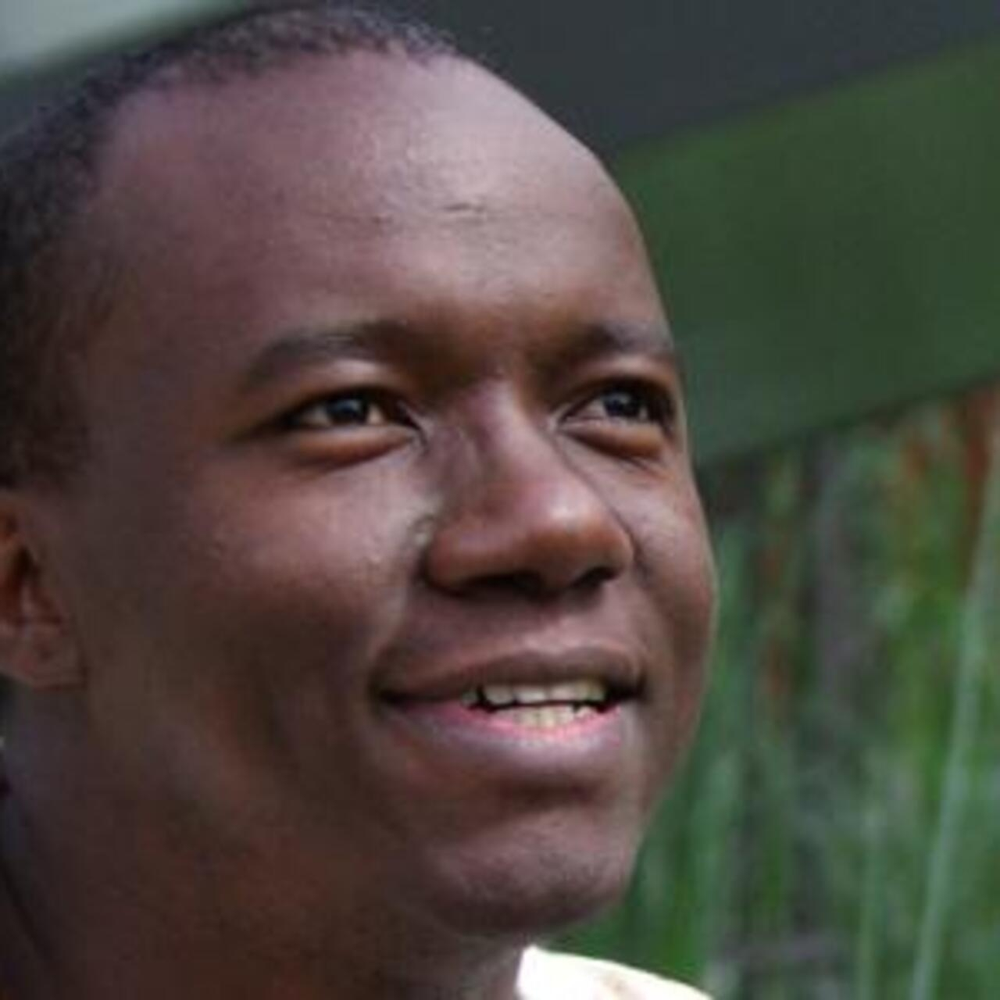

## Pr. Gayo Diallo

Gayo DIALLO, PhD, is Full Professor in Computer Sciences/Digital Health at the Bordeaux Population Health research Center, a joint lab between University of Bordeaux and INSERM. He is deputy director of the AHeaD team, a multidisciplinary research group with computer scientists/health informatics specialists, phamarcovigilance experts and medical doctors. He joined University of Bordeaux, Institute of Public Health in 2009 after being a research assistant at City University of London (UK) and Postdoc researcher at the Laboratory of Applied Computer Sciences in Poitiers (France). His research interests include AI based approach for healthcare data and knowledge management and ICT for societal Development with a particular focus on the healthcare sector. He participated in various EU funded projects and coordinated several international e-health projects. He authored or  co-authored 100+ peers reviewed papers. Its algorithms and tools have been awarded at numerous official international competitions, including the health practical application prize of the Orange Data for Development Big Data Challenge (D4D). Gayo Diallo has been recently visiting professor at University of Minnesota, Institute of Health Informatics (Zhang Research Lab) from January to August 2022.

---
## Abstract 
Nowadays, the healthcare sector is experiencing an abundance of digitalized data to enable digital health and efficient health related decision making. However, in the global south, in particular Africa, the lack of reliable health related information makes it difficult to develop effective health policies.

In this talk I will address some issues that the global south usually experience in designing and implementing reliable digital health systems. I will address in particular some multidisciplinary works related to bringing semantic technologies and AI based approaches that are conducted to enable digital public health.