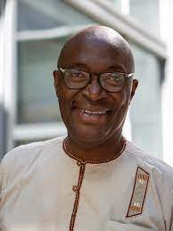

## Pr. Roch H. Glitho

Roch H. Glitho is a Full Professor at Concordia University (Montreal) where he holds the Ericsson/ENCQOR Industrial Research Chair in Cloud/Edge for 5G and Beyond. He has held a Canada Research Chair from 2010-2020, and prior to joining academia in 2010 he has held several senior technical positions at Ericsson in Stockholm and Montreal. . He is  a Professor Extraordinaire at the University of Western Cape (South Africa), and is active in teaching and curriculum development at IMSP – Dangbo. He holds a PhD in Tele-informatics (KTH – Stockholm), Master degrees in pure mathematics (University of Geneva), computer science (University of Geneva) and business economics (University of Grenoble).

---
## Abstract 

Robotic surgery gives an immersive view to the surgeon and enables 
more precision. This results in less pain, less blood loss, and 
speedier recovery. It emerged in the early 2000s and is getting more 
and popular. Robotic surgery procedures are performed today with 
surgeon and patient confined in the same room with dedicated 
communication links between the surgeon console and the robot – 
However, technologies such as machine learning, Tactile Internet, 
5G/6G are poised to enable remote robotic surgery. The expected 
benefits are immense. Experts surgeons in main cities will for 
instance be able to perform robotic surgeries on patients located far 
in rural areas. In this presentation, we introduce robotic surgery and 
discuss the intelligence challenges related to remote tactile Internet 
robotic surgery. We also introduce machine learning and show how it 
can be used to tackle the intelligence challenges. The focus is on how 
to predict the content of messages sent by the surgeon console and 
which may not reach the robot in time.