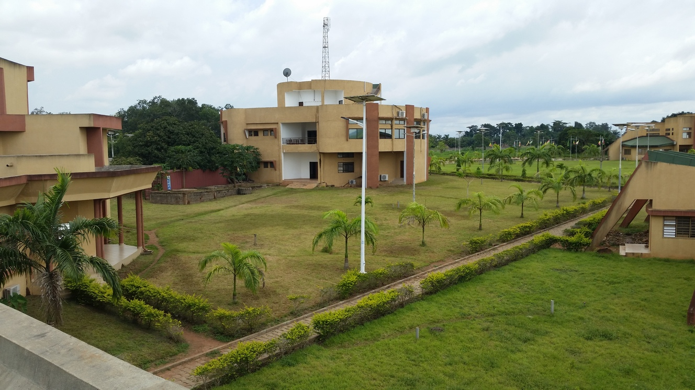

Data Science School 2022 
=============================

## Objectives
The industry interest and adoption of data science continues to grow as it leverages big data to achieve higher levels of business value. During this third edition of Data Science School combined with the fourth edition of Business Intelligence & Semantic Web seminar, participants will learn and put in practice solutions around recent data science concepts, tools, and techniques for data collection, ingestion, transformation, and consolidation.

At the end of the school, the participants should be able to :
- Understand the main concepts and techniques behind big data frameworks and architectures, 
- Practice machine learning pipelines implementation
- Use data science tools and systems
- Practice data visualization tools
- Use knowledge engineering tools
- Understand semantic web paradigm.

## Participants
IT professionals, engineers, consultants, students interested in Data Science and Business Intelligence concepts along with their practices.

### Number of expected participants 
We estimate about 60 people to attend the school. This number includes the teachers and taking into account the distribution of men and women. Thus, expected  participants can be distributed as follows: 
- Senegal: 15 
- Burkina Faso: 10 
- Niger: 5 
- Benin: 30

## Addressed Topics

1. Introduction to Data Science (Architecture and paradigms)
2. Cloud-based deployment (Google Cloud Platform)
3. Data Engineering with NoSQL and data models (graph and column-oriented)
4. Data Processing with Spark and Hadoop
5. Deep learning processes parallelization and cluster mapping with TensorFlow
6. Data Visualization
7. Methodologies for presenting results
8. Semantic Web 
9. IoT and data stream
10. Constraint programming
11. Big data mining 
12. Knowledge engineering
13. Knowledge graphs and applications 
14. Linked Data 
15. NLP and AI applications
16. Personal data in data science 
17. Operational Research and AI 
18. Law or ethics in data science exploitation
19. Big data and bank loans
20. Case Studies: Applications on e-health Information Systems

## Organizers
- Jules Degila (Bénin)
- Ghislain Atemezing (France)
- Ratheil Houndji (Bénin)
- Pélagie Houngue (Bénin)
- Carlos Ogouyandjou (Bénin) 
- Joël Tossa (Bénin) 
- Hénoc Soude (Bénin) 
- Arnaud Ahouandjinou (Bénin) 
- Sadouanouan Malo (Burkina-Faso)
- Camara Gaoussou (Sénégal) 

## Venue

This event will be held at the [Institut de Mathématiques et de Sciences Physiques (IMSP)](http://www.imsp-benin.com/home/) Dangbo, Bénin.

The details for the remote participation will be shared here in due time.

## Program

Check the program details [here](program.md)

## Speakers

The list of the speakers is available [here](speakers.md)

## Registration

[Link to register](https://ai4africa.github.io/DSS22/). Deadline: ** September, 16th, 2022 **

## Partners

List of university partners [here](partners.md)

## Sponsors
- [CEA-SMIA](https://ceasma-benin.org/)
- [MONDECA](https://mondeca.com/)

