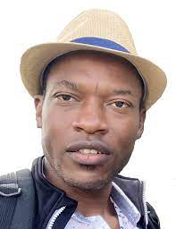

## Dr. Michel Kana

Michel is a dynamic, accomplished, multidisciplinary Senior Data Scientist, highly regarded for guiding software engineering efforts and implementing machine learning techniques to solve complex problems within large distributed systems. Michel was previously head of Data Science @Socialbakers, Prague. He is an Out-of-the-box thinker with extensive knowledge of mathematical modeling, neural networks, deep learning, and statistical concepts, combined with an extensive background in dealing with large datasets and deploying real-time algorithms for Fortune 500 companies. Known for ability to link neuroscience and machine learning through academic engagements, research experience, and lecturer experience in modeling/simulation of biological processes. As a Prince 2 Certified, recognized for effectively guiding and supporting critical projects, understanding stakeholder requirements, and delivering on all goals. Accepted as a strong communicator who ensures continued coordination with diverse individuals. Michel is among the top 50 bloggers on AI at Towards Data Science, and member of the Alumni of Harvard University.

---