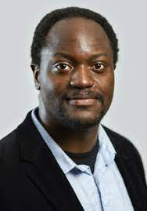

## Pr. Axel-Cyrille Ngonga

Axel Ngonga is a professor at Paderborn University, where he heads the Data Science Group. He is also a director of the Joint Artificial Intelligence Institute Paderborn-Bielefeld and the coordinator of the KnowGraphs MSCA ITN. Axel studied Computer Science in Leipzig. His PhD thesis was on knowledge-poor methods for the extraction of taxonomies from large text corpora. After completing his PhD in 2009, he wrote a Habilitation on link discovery with a focus on machine learning and runtime optimization. After leading the AKSW research group for four years, Axel went on to lead the DICE research group at Paderborn University. His research group focuses on foundational research on data-driven methods to improve the lifecycle of knowledge graphs. These include techniques for the extraction of knowledge graphs, the verification of their veracity, their integration and fusion, their use in machine learning, and their exploitation in user-facing applications such as question answering systems and chat bots. Axel has served in various functions at multiple international conferences, including ISWC, ESWC, WWW, AAAI, ECAI, and IJCAI. He is the grateful recipient of over 25 international research prizes, including a Next Einstein Fellowship and several best research paper awards. His group is funded by grants from the German Research Foundation, the German Ministry for Economic Affairs and Climate Action, the German Ministry of Education and Research, and the European Commission.

---
## Abstract 