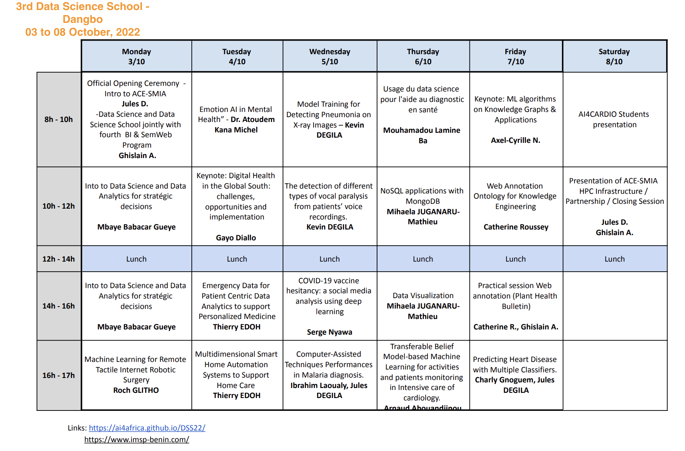

## Schedule
Nota: This schedule is local time, GMT +1. 

---

- **Monday, 03 October 2022**
  - 08:00-10:00 Official Opening Ceremony
    - Intro to ACE-SMIA (**Jules D.**)
    - Data Science and Data Science School jointly with fourth  BI & SemWeb Program (**Ghislain A.**)
  - 10:00-12:00 
    - Intro to Data Science and Data Analytics for strategic decisions **Mbaye Babacar Gueye** ( [bio & abstract](mbaye.md) )
  - 12:00-14:00 *Lunch*
  - 14:00-16:00 
    - Intro to Data Science and Data Analytics for strategic decisions **Mbaye Babacar Gueye**  ( [bio & abstract](mbaye.md) )
  - 16:00-18:00 ML and Robotic Surgery
    - Machine Learning for Remote Tactile Internet Robotic Surgery
        **Roch GLITHO** ([bio & abstract](glitoh.md) )

- **Tuesday, 04 October 2022**
  - 08:00-10:00 
    - Emotion AI in Mental Health 
       **Atoudem Kana Michel** ([bio & abstract](kana.md) )
  - 10:00-12:00 
    -  Digital Health in the Global South: challenges, opportunities and implementation
       **Gayo Diallo** ([bio & abstract](gayo.md) )
  - 12:00-14:00 *Lunch*
  - 14:00-16:00 
    - Emergency Data for Patient Centric Data Analytics to support Personalized Medicine
       **Thierry EDOH** ([bio & abstract](edoh.md) )
  - 16:00-18:00 
    - Multidimensional Smart Home Automation Systems to Support Home Care 
       **Thierry EDOH**  ([bio & abstract](edoh.md) )
      
  
- **Wednesday, 05 October 2022**
  - 08:00-10:00 Official Opening Ceremony
    - Model Training for Detecting Pneumonia on X-ray Images
       **Kevin DEGILA**
  - 10:00-12:00 
    - The detection of different types of vocal paralysis from patients’ voice recordings. 
      **Kevin DEGILA**
  - 12:00-14:00 *Lunch*
  - 14:00-16:00 
    - COVID-19 vaccine hesitancy: a social media analysis using deep learning
     **Serge Nyawa**
  - 16:00-18:00 Hands-On Session
    - Machine Learning for Remote Tactile Internet Robotic Surgery
        **Roch GLITHO** ([bio & abstract](glitoh.md) )
- **Thursday, 06 October 2022**
 - 08:00-10:00 
    - Usage du data science  pour l'aide au diagnostic en santé
       **Mouhamadou Lamine Ba**
  - 10:00-12:00 
    - NoSQL applications with MongoDB
      **Mihaela J.** ([bio & abstract](mihaela.md) )
  - 12:00-14:00 *Lunch*
  - 14:00-16:00 
    - Data Visualization
     **Mihaela J.** ([bio & abstract](mihaela.md) )
  - 16:00-18:00 
    - Transferable Belief Model-based Machine Learning for activities and patients monitoring in Intensive care of cardiology. 
      **Arnaud Ahouandjinou**
- **Friday, 07 October 2022**
 - 08:00-10:00 
    - Keynote: ML algorithms on Knowledge Graphs & Applications
     **Axel-Cyrille N.** ([bio & abstract](ngonga.md) )
  - 10:00-12:00 
    - Web Annotation Ontology for Knowledge Engineering
      **Catherine R.** ([bio & abstract](roussey.md) )
  - 12:00-14:00 *Lunch*
  - 14:00-16:00 
    - Intro to Data Science and Data Analytics for stratégic decisions **Mbaye Babacar Gueye** ( [bio & abstract](mbaye.md) )
  - 16:00-18:00 
    - Practical session Web annotation (Plant Health Bulletin)
     **Catherine R., Ghislain A.** ([bio & abstract](roussey.md) )
-  **Saturday, 08 October 2022**
   - 08:00-10:00 
    - AI4CARDIO Students presentation
  - 10:00-12:00 
    - Presentation of ACE-SMIA HPC Infrastructure / Partnership / Closing Session (**Jules D., Ghislain A.**) 
  - 12:00-14:00 *Lunch*
  - 14:00-16:00 
    - Social Event (What do you want to visit? Please, some suggestions.)
