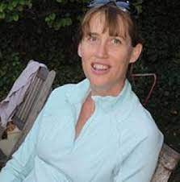

## Dr. Catherine Roussey

Catherine ROUSSEY is presently a researcher at the French National Research Institute for Agriculture, Food and Environment (INRAE). She belongs to the team COPAIN of the TSCF Laboratory. Her research topics are ontology design, knowledge representation, context representation, semantic web, semantic sensor network, spatial reasoning.
From 2011 to 2021, She was a researcher at the French National Research Institute for Sciences and Technologies in Environnement (IRSTEA)" formerly known as Cemagref. From 2002 to 2011 she was an Assistant Professor in the Claude Bernard University of Lyon 1. She used to teach database courses at the Computing Department of the Technical University Institute called IUTA located in Bourg en Bresse. At that time, Dr Catherine Roussey was a member of the Lyon Research Center for Images and Intelligent Information Systems (LIRIS). She used to work with Sylvie Calabretto in multilingual information retrieval and document management system. She also worked with Robert Laurini about urban ontology. Since September 2022, she is now part of the INRAE - CUMR Mistea team in Montpellier, France. 

---
## Abstract 